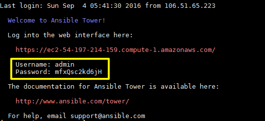
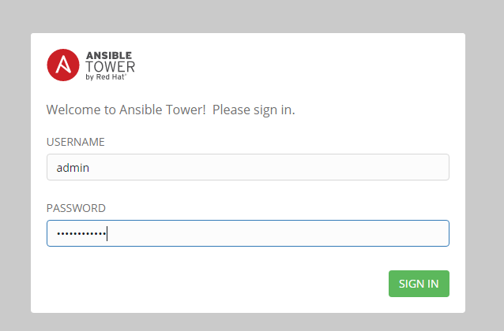
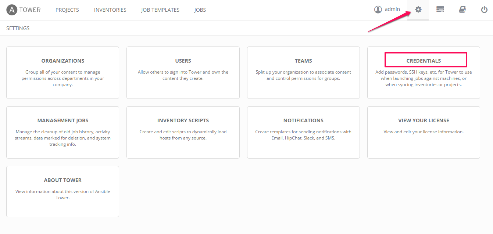
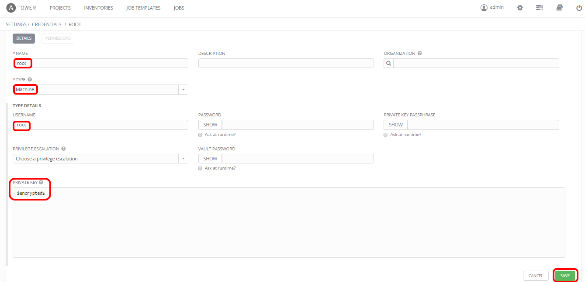
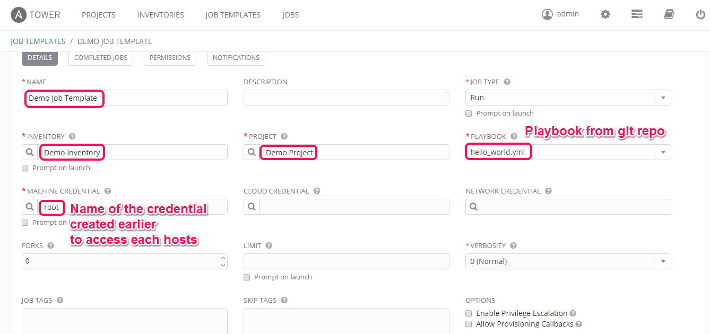

## Ansible Tower

If you have an AWS account choose an AMI and launch the Tower by clicking on an AMI [link](https://www.ansible.com/tower-trial), based on your preferred EC2 region.

#### Minimum Requirements For Amazon EC2:

* Instance size of m3.medium or larger
* An instance size of m3.xlarge or larger if there are more than 100 hosts
* 20 GB of dedicated hard disk space

#### Setup

Launch an instance and connect to it using ssh.

Once connected, in `motd` you will get the **username** and **password**.

```
password = mfxQsc2kd6jH
```



Once setup is complete, use your web browser to access the Tower server using the public ip of instance and view the Tower login screen.


#### Setting up multiple hosts

* Launch multiple EC2 instance.
* Create ssh key in controller and copy public key to all other instance in /root/.ssh/authorized_keys.
  * This is to get ssh access to each instances or hosts.
* In Ansible Tower choose settings->credentials
  * Setup new credentials for `Type: AWS`



  * Give `NAME` `ACCESS KEY` & `SECRET KEY` for establishing a connection to your AWS account.


  * Setup another one credentials for `Type: Machine`
    * Paste private key generated in controller here(while saving it will get encrypted as below) for accessing the hosts(which contains the public key).



#### Setting up Projects

Edit the existing `Demo Project` and change the `SCM URL` to your existing git repo.

#### Setting up Inventory

Edit the existing `Demo Inventory` and add a new `group`.


#### Setting up Job Templates

Edit the existing `Demo Job Template`



#### Setting up yml in git repo

[Git Repo ](https://github.com/MeenachiSundaram/ansible-training-demo.git) for **hello_world.yml**

```
---
- name: Hello World Sample
  hosts: all
  tasks:
    - name: Hello Message
      debug:
        msg: "Hello World!"

- name: Only RHEL
  hosts: ami_2051294a
  user: ansible
  gather_facts: true

  tasks:
     - name: Hello User
       debug:
         msg: "Hello user!"

- name: Only Ubuntu
  hosts: ami_2d39803a
  remote_user: root
  gather_facts: true

  tasks:
     - name: Update Packages
       apt: update_cache=yes
       become: yes
       become_method: sudo
     - name: install the latest version of Apache
       apt: name=apache2 state=latest

- name: Only Ubuntu
  hosts: tag_node_3
  remote_user: root
  gather_facts: true

  tasks:
     - name: Stop Apache service
       service: name=apache2 state=stopped
```
